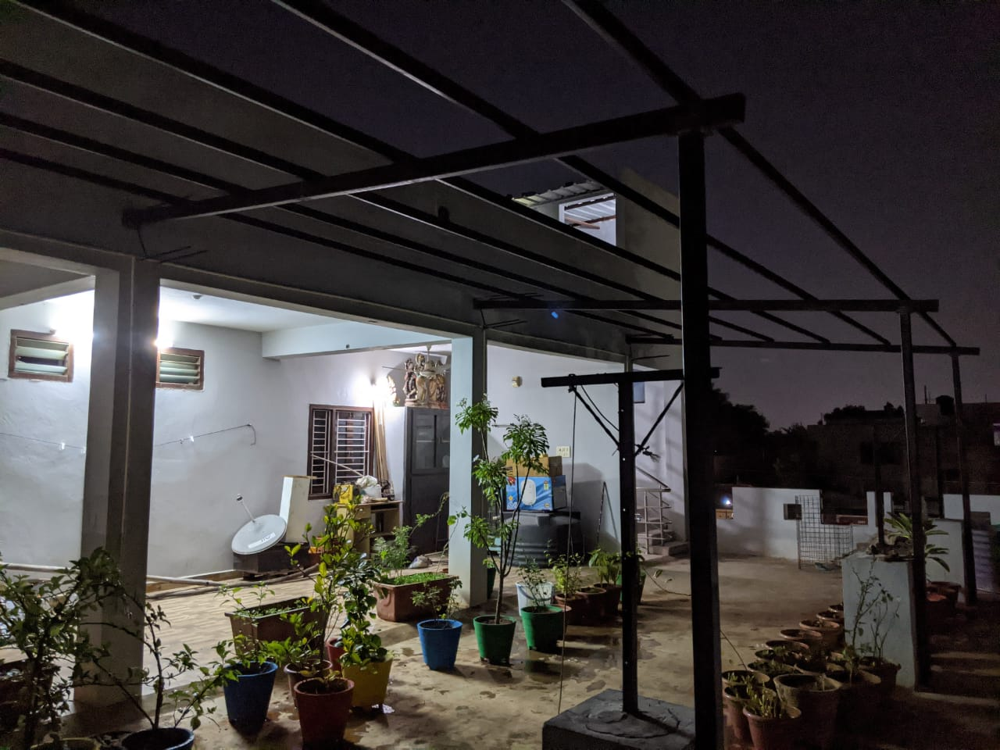
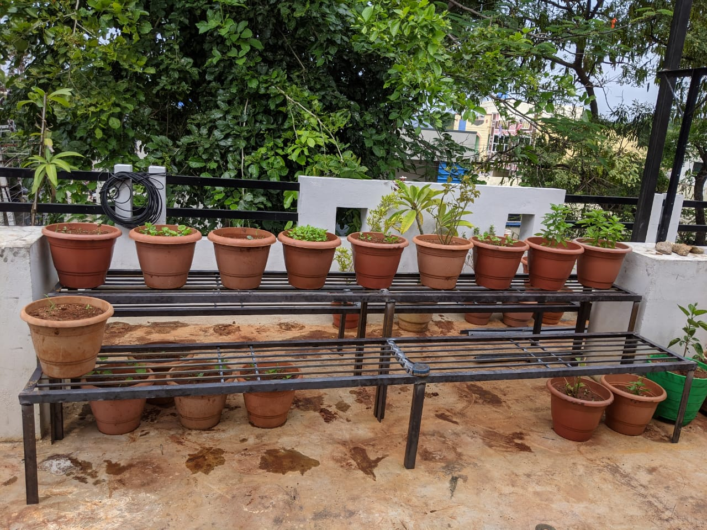

Since 2016, we've been growing plants on the terrace. Largely, flower-based plants with healthly mix of tulasi and basil. Basil grew well over the years. Rest just survived without many flowers.

In many ways, gardening is like coding. You need to constantly practice it to be good at it. The bare minimum is watering the plants. But a garden needs much more than just watering: resoiling periodically, weeding out the insects, picking seasonal plants to sow etc. It's a full tome job.

Last year, we got an interior designer to help design it but didn't pursue it due to hospital visits the entire year.

As part of other minor household construction works, we are now revamping the terrace garden.

## Structures

## Stands

