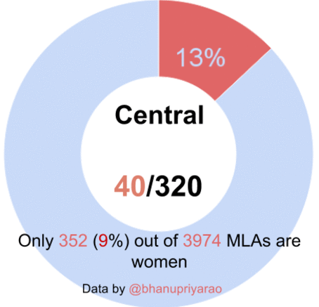
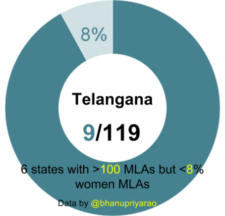

#### 16th May - Google Mobility Data for India

I looked at Google [Mobility data for India](https://bkamapantula.github.io/2020/05/16/google-mobility.html)
which reports pre and post Covid-19 activity levels for different areas.

-----

#### 4th March - Annual Leadership Summit

I attended my third annual Gramener leadership summit and [wrote about it](https://bkamapantula.github.io/2020/03/04/leadership-summit-2020.html).

-----

#### 10th February - Hyderabad Libraries, Joyful Data

I wrote about visting [libaries](https://bkamapantula.github.io/2020/02/10/hyderabad-libraries.html) in Hyderabad.

Joyful Data is a creative way to make data-driven graphics. I wrote on [my experience](https://bkamapantula.github.io/2020/02/08/joyful-data.html) using it.

#### 5th February - Posts

I wrote about [team communication](https://bkamapantula.github.io/2020/02/05/team-communication.html) and mapping [family travels](https://bkamapantula.github.io/2020/02/05/travel-map.html).

#### 24th January - Women protests map

I created a map highlighting women-led protests against NRC/NPR/CAA in India. Featured in [Behan Box article](https://www.behanbox.com/women-led-protest-map-against-citizenship-laws-in-india/). I tried Datawrapper map this time which turned out to be easy to use. Data can have multiple entries for a single city/state combination. Using addresses to map in Datawrapper will only retain the latest entry for a city/state that has multiple entries. Using Latitude/Longitude is a better option to address it.

#### 21st January - Data art

I wrote about [data art](https://bkamapantula.github.io/2020/01/21/data-art-round-1.html)\!

#### 15th January - Gifts

I wrote a new post on [gifts](https://bkamapantula.github.io/2020/01/15/gifts.html)!

#### 13th January - Comics workshop @ Bangalore

We organized a [data comics workshop](https://www.meetup.com/meetup-group-EkjzkhLt/events/266798548/) in Bangalore on 11th Jan. Grofers graciously offered venue for the event. With [64 participants](https://twitter.com/Gramener/status/1215851094032535552) attending the workshop, we had fun organizing and viewing everyone's work. Blog post soon!

#### 3rd January - 2019 review

I reviewed how [my 2019](https://bkamapantula.github.io/2020/01/03/2019.html) went.

#### 1st January 2020 - Break

He'll be away from Gramener for three months (Jan to Mar 2020) to focus
on [curating food
recipes](https://bkamapantula.github.io/2020/01/03/food-recipes.html).

-----

#### December 2019 - Data storytelling events

Completed organizing eight monthly data storytelling events
(Hackathons/Workshops)
([meetup](https://www.meetup.com/meetup-group-EkjzkhLt/)). What started
as an internal event now extends to external participants. Browse
[\#datastoryday](https://twitter.com/hashtag/datastoryday?src=hashtag_click)
or
[\#comicsworkshop](https://twitter.com/hashtag/comicsworkshop?src=hashtag_click)
on Twitter.

-----

#### October 2019 - Blog update

I replicated my writings at [Gramener
blog](https://blog.gramener.com/?s=bhanu) to a separate space on [my
GitHub pages](https://bkamapantula.github.io).

-----

#### January 2018 - Switching roles

After year and half of building products, he switched to creating
client-facing visual solutions in late Jan 2018.

-----

#### August 2016 - Gramener

Inspired by the work of [Anand](http://www.s-anand.net/), he joins
[Gramener](https://www.gramener.com) in late 2016 in the product team.
Work involved contributions to Autolysis - an auto-insight generator,
CRUD edits (FormHandler) for Gramex
[FormHandler](https://learn.gramener.com/guide/formhandler).

-----

#### Brief postdoc

Quit postdoc at University of Wisconsin, Madison after 4 months in
mid-June 2016. He was involved in understanding functional significance
of relations between genes and transcription factors.

-----

#### Bhanu completes Ph.D. - December 2015

-----

#### Nature Scientific Reports - August 2015

Our work, *miRegulome: a knowledge-base of miRNA regulomics and
analysis*, is accepted in Nature Scientific Reports. To read, [visit the
page](http://www.nature.com/articles/srep12832).

-----

#### BMC Genomics - May 2015

Our work, *DISMIRA: Prioritization of disease candidates in
miRNA-disease associations based on maximum weighted matching inference
model and motif-based analysis*, is accepted in BMC Genomics. [Read
here](http://www.biomedcentral.com/1471-2164/16/S5/S12).

-----

#### Gender in Politics - (15th April 2015)

[Gender in Politics](http://genderinpolitics.org/) - An initiative to
analyze women participation in Indian politics is underway. In
collaboration with [@bhanupriyarao](https://twitter.com/bhanupriyarao).

-----

#### 7th March 2015

[Women in Parliament: Where does India figure among the rest of the
World?](https://factly.in/women-in-parliament-where-does-india-figure-among-the-rest-world/)
With [@bhanupriyarao](https://twitter.com/bhanupriyarao).

 

-----

#### 16th February 2015

Contributed visualizations to [As Arvind Kejriwal's cabinet meets in
Delhi, the one thing that makes AAP's government just like any
other](http://scroll.in/article/707064/As-Arvind-Kejriwals-cabinet-meets-in-Delhi-the-one-thing-that-makes-AAPs-government-just-like-any-other).
Authored by [@bhanupriyarao](https://twitter.com/bhanupriyarao). *Images
have been recolored in the article.* Original images are presented below
with overlaid text.

 

North/East/Central/South/West/Northeast in first two charts represent
regions in India.
